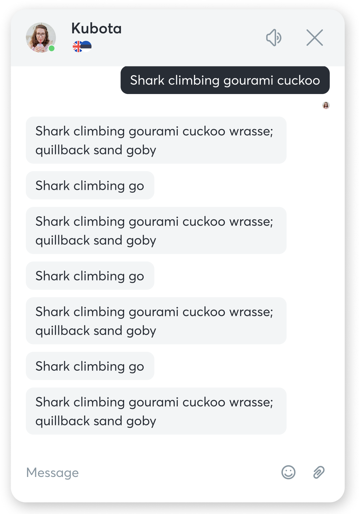

# Test assignment for FE developer position

Create a simple chat app that will display and send messages. Messages will be fetched/sent from a 3rd party GraphQL API service.

### Visual example:



### Requirements:

- Use `React` + `Typescript` (preferably with `hooks`)
- Use `Apollo` for communication with `GraphQL` API
- The exact colors, fonts, or icons are **not important**
- **No need** to use `Subscriptions`, just `Query` (with **pagination** would be a plus) to get messages and `Mutation` (with **optimistic response** would be a plus) to send
- **No need** to implement emoji, attachments, or sound functionality as shown in the visual example
- Tests are **optional**
- **Readable, clear, maintainable, and logical** code is highly welcomed

### API:

For this task you will need to use:

- query to get messages
- mutation to send messages

In query you can provide limit/offset values for pagination and orderBy for changing messages order.

For sending messages you will need to provide **body** and **senderName**.

### Examples:

```graphql
query getMessages {
  messages(
		limit: Int
		offset: Int
		order_by: [messages_order_by!] (example: order_by: {id: asc})
	) {
    id
    body
    senderName
  }
}
```

```graphql
mutation sendMessage {
  insert_messages_one(object: { body: String, senderName: String }) {
    id
    body
    senderName
  }
}
```

### Link to API:

Please provide this URL for ApolloClient:

[https://guided-ferret-24.hasura.app/v1/graphql](https://guided-ferret-24.hasura.app/v1/graphql)

Also, provide a special authorization header to ApolloClient:

```json
"x-hasura-admin-secret": "eVsdOYwA85ygQDejX1eojS1A2OLab4d2tZb3aWWXJuQUrpSk7euySuWvCbIuxen5"
```

> The completed task can be pushed to Github and link to repo sent to us

